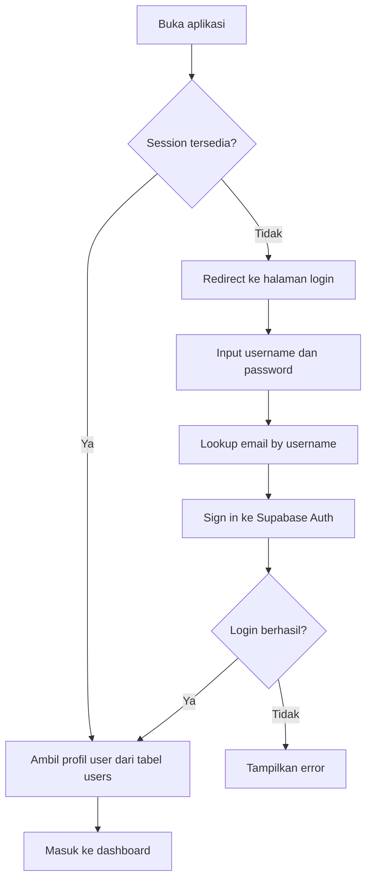
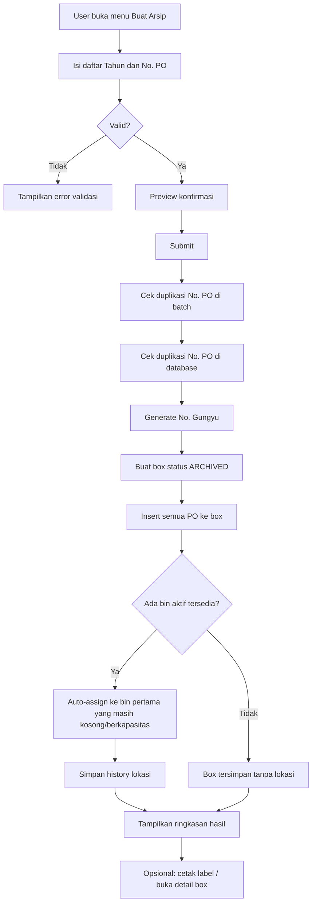
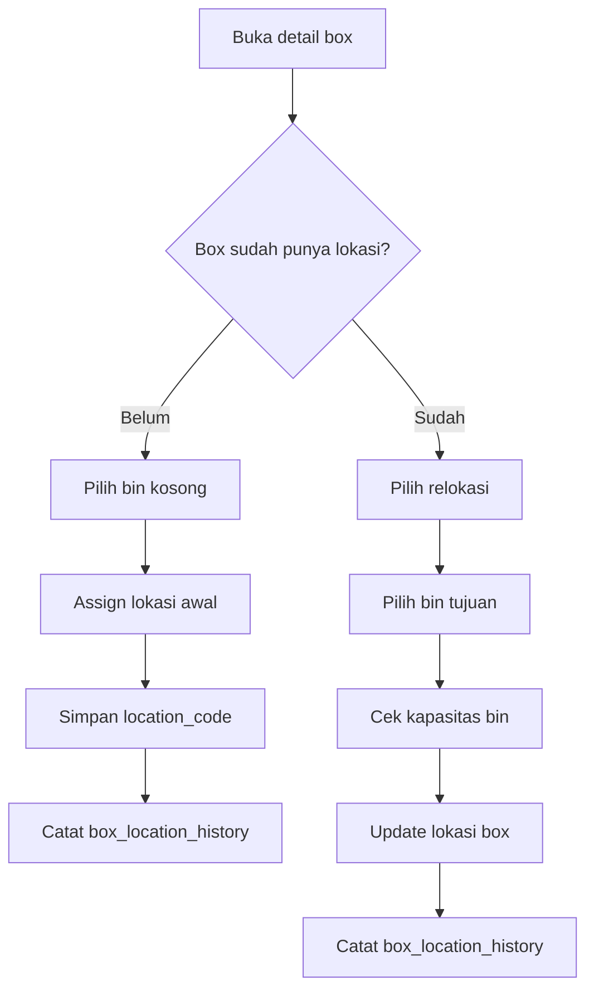
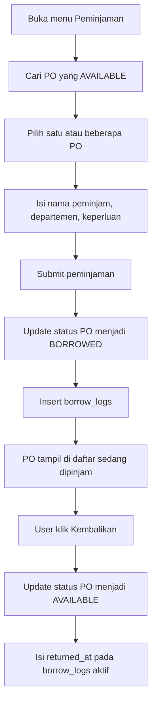
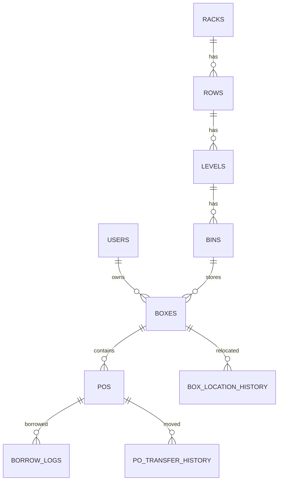

# Product Requirements Document (PRD)

## Sistem Arsip PO

Status: Draft berbasis analisis source code  
Tanggal analisis: 2 April 2026  
Basis analisis: `frontend/`, `supabase/`, route UI, layer API, migrasi, dan seed data

## 1. Ringkasan Produk

Sistem Arsip PO adalah aplikasi internal untuk mengelola arsip dokumen Purchase Order (PO) milik departemen pengadaan. Aplikasi ini menghubungkan arsip digital dengan penyimpanan fisik berbasis box dan lokasi rak, sekaligus menyediakan proses pencarian, peminjaman, pengembalian, relokasi, pencetakan label, dan histori perubahan.

Dalam implementasi saat ini, satu box berisi banyak PO. Setiap box dapat ditempatkan ke satu bin pada struktur rak fisik: `Rack > Row > Level > Bin`. Saat arsip dibuat, sistem secara default langsung membentuk box baru, menghasilkan nomor `No. Gungyu`, lalu mencoba mengisi bin aktif pertama yang masih tersedia secara berurutan.

## 2. Latar Belakang Masalah

Proses arsip PO biasanya menghadapi beberapa masalah:

- Dokumen PO sulit ditelusuri karena data digital dan lokasi fisik tidak terhubung.
- Risiko kehilangan jejak meningkat saat PO dipinjam atau dipindahkan.
- Kapasitas rak sulit dipantau tanpa visualisasi struktur penyimpanan.
- Penamaan box dan lokasi penyimpanan rawan tidak konsisten jika dilakukan manual.
- Kebutuhan pencarian cepat sering berbenturan dengan arsip fisik yang tersebar.

Produk ini hadir untuk menjadikan PO mudah dicatat, dicari, dipinjam, dikembalikan, dipindahkan, dan diaudit.

## 3. Tujuan Produk

### Tujuan bisnis

- Menjadikan arsip PO lebih rapi, terlacak, dan dapat diaudit.
- Mengurangi waktu pencarian dokumen PO.
- Mengurangi kesalahan penempatan box di rak.
- Menyediakan histori aktivitas arsip untuk kebutuhan kontrol internal.

### Tujuan pengguna

- Buyer/Admin dapat membuat arsip PO dengan cepat.
- Pengguna dapat mengetahui box dan lokasi fisik dokumen tanpa membuka banyak sumber data.
- Pengguna dapat meminjam dan mengembalikan PO dengan jejak log yang jelas.
- Pengelola arsip dapat memonitor kapasitas rak dan melakukan relokasi bila diperlukan.

## 4. Ruang Lingkup Produk

### In scope

- Login pengguna berbasis Supabase Auth.
- Manajemen user aktif berbasis role `admin` dan `buyer`.
- Pembuatan arsip baru berbasis daftar nomor PO.
- Pembuatan box otomatis dengan `No. Gungyu`.
- Penempatan box ke bin secara otomatis atau manual.
- Pengelolaan daftar PO lintas box.
- Pengelolaan daftar box dan detail box.
- Pemindahan PO antar box.
- Peminjaman dan pengembalian PO.
- Pencarian PO.
- Upload, preview, download, dan hapus file scan dokumen PO.
- Pengelolaan struktur rak fisik.
- Histori arsip masuk, perpindahan PO, dan relokasi box.
- Dashboard ringkasan KPI dan aktivitas terbaru.
- Cetak label per box dan cetak massal beberapa box.

### Out of scope untuk versi saat ini

- Approval workflow.
- Multi-level authorization.
- Notifikasi email/WhatsApp.
- OCR dokumen.
- Barcode/QR scanning.
- Audit log keamanan tingkat enterprise.
- Retention policy / jadwal pemusnahan arsip.
- Versioning file dokumen.

## 5. Persona Pengguna

### 1. Buyer

Kebutuhan utama:

- Membuat arsip PO miliknya.
- Melihat daftar arsip dan box.
- Menelusuri lokasi box.
- Mengelola metadata PO.
- Meminjam dan mengembalikan PO.

### 2. Admin

Kebutuhan utama:

- Mengelola arsip lintas buyer.
- Menentukan buyer/PIC saat membuat arsip.
- Mengelola struktur rak dan kapasitas penyimpanan.
- Merelokasi box.
- Memindahkan PO antar box.
- Menghapus PO atau box bila dibutuhkan.

Catatan implementasi saat ini:

- Role `buyer` dan `admin` sudah ada di model data.
- UI navigation saat ini masih menampilkan menu yang sama untuk kedua role.
- Beberapa aksi sensitif terlihat tersedia umum di UI/client dan belum tampak dibatasi keras di layer otorisasi aplikasi.

## 6. Terminologi Inti

- `PO`: dokumen Purchase Order.
- `Box`: wadah arsip fisik yang berisi satu atau lebih PO.
- `No. Gungyu`: identitas box/arsip.
- `Rack > Row > Level > Bin`: hirarki lokasi penyimpanan fisik.
- `ARCHIVED`: box aktif yang dianggap sebagai arsip.
- `CANCELLED`: box dibatalkan.
- `AVAILABLE`: PO tersedia dan tidak sedang dipinjam.
- `BORROWED`: PO sedang dipinjam.

## 7. Gambaran Solusi

Sistem dibangun sebagai aplikasi web internal berbasis Next.js dan Supabase. Frontend menarik data langsung dari Supabase melalui query client-side, sementara upload file menggunakan route handler server-side dan Cloudflare R2. Produk menggabungkan:

- arsip digital,
- lokasi fisik,
- histori operasional,
- dan pencetakan label fisik.

Dengan begitu, alur digital dan alur gudang/arsip dapat bertemu pada satu sistem.

## 8. Alur Produk Utama

### 8.1 Login dan akses dashboard

### 8.2 Pembuatan arsip baru

### 8.3 Penempatan dan relokasi box

### 8.4 Peminjaman dan pengembalian PO

## 9. Modul dan Kebutuhan Fungsional

### A. Authentication

Fitur:

- User login menggunakan `username` dan `password`.
- Username dipetakan ke email di tabel `users`.
- Session disimpan lokal dan dipulihkan saat reload.
- User tanpa session diarahkan ke halaman login.

Kebutuhan:

- Sistem harus memvalidasi user aktif (`is_active = true`).
- Sistem harus memuat profil user berdasarkan `auth_id`.
- Sistem harus mengizinkan logout dan menghapus session lokal.

### B. Dashboard

Fitur:

- Menampilkan KPI total PO, total box, pinjaman aktif, kapasitas rak, overdue borrow, tren, top buyer, aktivitas terbaru, dan box terbaru.

Kebutuhan:

- Sistem harus menampilkan ringkasan data operasional utama.
- Sistem harus membantu user mengenali kondisi arsip saat ini tanpa membuka halaman detail.
- Sistem harus memuat data dashboard dari RPC agregat agar lebih efisien.

### C. Pembuatan Arsip

Fitur:

- Input banyak nomor PO dalam satu box.
- Bulk paste nomor PO.
- Validasi tahun dan duplikasi.
- Admin dapat memilih buyer/PIC pemilik arsip.
- Hasil sukses menampilkan ringkasan dan opsi cetak label.

Kebutuhan:

- Satu submit harus menghasilkan satu box baru.
- Minimal satu PO wajib diinput.
- Nomor PO dalam satu submit tidak boleh duplikat.
- Nomor PO yang sudah ada di sistem tidak boleh dipakai ulang.
- Sistem harus menghasilkan `No. Gungyu`.
- Box baru default berstatus `ARCHIVED`.
- Sistem sebaiknya auto-assign ke bin pertama yang tersedia.

### D. Daftar PO

Fitur:

- Tabel daftar semua PO.
- Sorting, filter kolom, pencarian global, pagination.
- Edit metadata PO.
- Pindah PO antar box.
- Hapus PO.
- Upload file scan, preview, download, dan hapus file.

Kebutuhan:

- User harus dapat menemukan PO secara cepat.
- User harus dapat memperbarui metadata utama PO.
- Sistem harus mencatat histori saat PO dipindahkan.
- Jika PO terakhir dihapus/dipindahkan dari suatu box, sistem saat ini akan menghapus box lama beserta referensi histori terkait.

Catatan produk:

- Perilaku penghapusan otomatis box kosong perlu dikonfirmasi, karena cukup agresif untuk kebutuhan audit jangka panjang.

### E. Daftar Box dan Detail Box

Fitur:

- Melihat seluruh box dengan filter status, PIC, lokasi, dan jumlah PO.
- Melihat detail box.
- Menempatkan box ke bin.
- Merelokasi box.
- Memindahkan PO dari detail box.
- Menghapus box permanen.
- Cetak label box.
- Cetak massal label beberapa box.

Kebutuhan:

- Sistem harus menampilkan identitas box, pemilik, jumlah PO, dan lokasi.
- Box yang belum punya lokasi harus mudah diidentifikasi.
- User harus dapat mencetak label box sebagai artefak fisik.
- Sistem harus menjaga bin hanya dipakai sesuai kapasitas.

### F. Pencarian PO

Fitur:

- Pencarian cepat berdasarkan `no_po`, `nama_barang`, `buyer_name`, dan `keterangan`.
- Hasil pencarian menampilkan status pinjam, No. Gungyu, dan lokasi fisik.

Kebutuhan:

- Search harus menjadi jalur tercepat untuk menemukan lokasi arsip.
- Hasil pencarian harus menampilkan informasi digital dan fisik sekaligus.

Catatan implementasi:

- Halaman pencarian sudah ada, namun belum terlihat menjadi menu utama di sidebar.

### G. Peminjaman dan Pengembalian

Fitur:

- Pilih banyak PO untuk dipinjam.
- Input nama peminjam, departemen, dan keperluan.
- Lihat daftar PO yang sedang dipinjam.
- Kembalikan PO.
- Lihat riwayat peminjaman.

Kebutuhan:

- Hanya PO dengan status `AVAILABLE` yang boleh dipinjam.
- Saat dipinjam, status PO harus berubah ke `BORROWED`.
- Sistem harus menyimpan log peminjaman.
- Saat dikembalikan, status PO harus kembali `AVAILABLE` dan log aktif ditutup dengan `returned_at`.

### H. Histori

Fitur:

- Arsip masuk.
- Riwayat perpindahan PO.
- Riwayat relokasi box.

Kebutuhan:

- Sistem harus menyimpan jejak kapan box dibuat.
- Sistem harus menyimpan jejak mutasi PO antar box.
- Sistem harus menyimpan jejak perpindahan box antar bin.

### I. Manajemen Rak

Fitur:

- Kelola rack, row, level, bin.
- Tambah node secara inline.
- Hapus/nonaktifkan node.
- Heatmap kapasitas.
- Tooltip isi bin dan status pinjam.

Kebutuhan:

- Struktur rak harus mengikuti hirarki fisik nyata.
- Bin dapat diisi box sesuai kapasitas.
- Node dengan histori tidak selalu dihapus permanen; bisa dinonaktifkan untuk menjaga jejak.
- User harus bisa memonitor slot kosong vs terisi.

## 10. Aturan Bisnis Utama

1. Satu box dapat berisi banyak PO.
2. Satu PO hanya boleh berada di satu box pada satu waktu.
3. Satu box aktif hanya boleh memiliki satu lokasi bin pada satu waktu.
4. Satu bin memiliki kapasitas `max_boxes`, default saat ini `1`.
5. Nomor PO harus unik di seluruh sistem.
6. Box baru dibuat langsung dengan status `ARCHIVED`.
7. `No. Gungyu` digenerate oleh database function.
8. Hanya bin aktif yang boleh dipakai untuk penempatan atau relokasi.
9. PO dengan status `BORROWED` menandakan dokumen sedang keluar.
10. Penghapusan struktur rak harus mempertimbangkan isi aktif dan histori.
11. Bin/level/row/rack yang pernah punya histori dapat dinonaktifkan alih-alih dihapus.
12. Penghapusan box saat ini bersifat destruktif dan menghapus isi serta beberapa histori terkait.

## 11. Data Model Inti

Entitas utama:

- `users`
- `boxes`
- `pos`
- `borrow_logs`
- `racks`
- `rows`
- `levels`
- `bins`
- `po_transfer_history`
- `box_location_history`

Relasi konseptual:

## 12. Kebutuhan Non-Fungsional

### Performa

- Dashboard sebaiknya memakai agregasi server/database, bukan seluruh data client-side.
- Search harus terasa cepat untuk kebutuhan operasional harian.
- Tabel besar harus tetap usable dengan filter, sort, dan pagination.

### Keandalan

- Status pinjam harus dijaga konsisten.
- Upload file harus memvalidasi tipe dan ukuran.
- Operasi mutasi penting sebaiknya atomic atau memiliki rollback memadai.

### Keamanan

- Auth memakai Supabase Auth.
- Route upload/delete file memakai service role di server.
- Aksi sensitif idealnya dibatasi oleh otorisasi yang konsisten, bukan hanya UI.

### Auditability

- Histori perpindahan PO dan relokasi box harus mudah ditelusuri.
- Aktivitas create, borrow, return, relocate sebaiknya tetap dapat direkonstruksi.

### Usability

- Input bulk PO harus mendukung paste multi-baris.
- Pencarian harus sederhana dan langsung.
- Label cetak harus jelas dibaca untuk kebutuhan lapangan.

## 13. Acceptance Criteria Tingkat Tinggi

### Buat arsip

- User dapat membuat box baru dari satu atau banyak nomor PO.
- Sistem menolak nomor PO duplikat.
- Sistem menghasilkan box dengan `No. Gungyu`.
- Sistem menampilkan hasil pembuatan secara jelas.

### Kelola lokasi box

- User dapat melihat box tanpa lokasi.
- User dapat menempatkan box ke bin aktif yang tersedia.
- User dapat merelokasi box ke bin lain.
- Sistem mencatat histori lokasi.

### Kelola PO

- User dapat mencari, edit, pindah, dan hapus PO.
- User dapat mengunggah lampiran scan PO.
- User dapat melihat dokumen yang sudah diunggah.

### Peminjaman

- User dapat meminjam satu atau banyak PO yang tersedia.
- User dapat melihat daftar PO yang sedang dipinjam.
- User dapat mengembalikan PO dan menutup log aktif.

### Manajemen rak

- User dapat menambah rack/row/level/bin.
- User dapat menghapus atau menonaktifkan struktur sesuai kondisi histori.
- User dapat melihat heatmap okupansi rak.

## 14. Risiko dan Gap yang Terlihat dari Implementasi Saat Ini

1. Otorisasi belum tampak kuat di level backend/client action.
   Beberapa aksi sensitif seperti hapus box, hapus PO, relokasi, dan mutasi PO tampak tidak dibatasi ketat per role.

2. Penghapusan data cenderung destruktif.
   Box kosong dapat dihapus otomatis setelah mutasi/hapus PO, dan box deletion menghapus isi serta histori terkait.

3. Search belum menjadi entry point utama.
   Halaman pencarian ada, tetapi tidak muncul pada menu utama.

4. Ada indikasi inkonsistensi model dashboard.
   RPC dashboard memilih field `tahun` dari `boxes`, padahal model TypeScript `Box` yang terlihat tidak memiliki field itu.

5. Sebagian besar data dimuat langsung ke client.
   Untuk skala data besar, pendekatan fetch-all lalu filter di browser berpotensi menjadi bottleneck.

6. Fitur "remember me" dan "forgot password" di login belum terlihat fungsional.

7. Label print saat ini didesain kuat untuk kebutuhan fisik, tetapi kapasitas layout riil perlu divalidasi dengan volume PO aktual.

## 15. Rekomendasi Prioritas Produk Berikutnya

### Prioritas tinggi

- Perjelas permission matrix `admin` vs `buyer`.
- Tegaskan kebijakan delete vs soft delete untuk box/PO/history.
- Jadikan search sebagai jalur utama operasional.
- Tambahkan guard otorisasi untuk aksi sensitif.

### Prioritas menengah

- Tambahkan filter lanjutan untuk histori dan peminjaman.
- Tambahkan SLA/aging indicator yang lebih jelas untuk PO terlambat kembali.
- Tambahkan bulk action yang aman untuk operasi PO dan box.

### Prioritas lanjutan

- QR/barcode untuk box.
- Notifikasi pengingat pengembalian.
- Ekspor laporan.
- OCR/indexing file dokumen.

## 16. Pertanyaan Produk yang Perlu Dikonfirmasi

1. Apakah `buyer` memang boleh mengakses semua menu operasional, atau hanya subset tertentu?
2. Apakah box kosong seharusnya dihapus otomatis, atau tetap dipertahankan untuk audit?
3. Apakah `CANCELLED` masih dipakai aktif dalam proses bisnis, karena dari UI alur cancel belum tampak jelas?
4. Apakah pencarian seharusnya tersedia di menu utama?
5. Apakah file dokumen perlu versioning dan riwayat perubahan?
6. Apakah peminjaman perlu approval atau cukup self-service oleh admin/internal staff?
7. Apakah satu bin akan selalu menampung satu box, atau kapasitas >1 memang akan sering dipakai?

## 17. Catatan Analisis

- PRD ini disusun dari perilaku aplikasi yang tampak di codebase, bukan dari dokumen bisnis formal.
- File `issue.md` dan `TECH_STACK.md` yang disebut di tab editor tidak ditemukan pada root repo yang saya analisis, sehingga dokumen ini terutama diturunkan dari implementasi aktual.
- Beberapa poin di atas adalah inferensi dari source code dan perlu divalidasi dengan stakeholder bisnis sebelum dijadikan baseline final.
